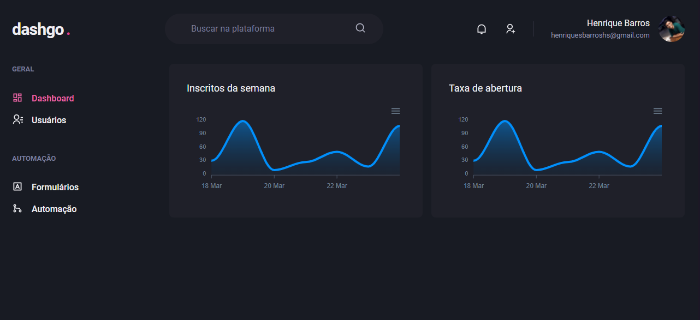
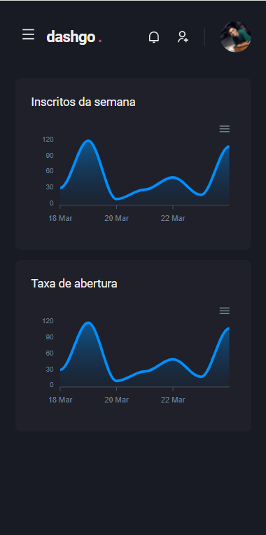

# dashgo

    

    

 

# Dependências 

* [ReactJS](https://pt-br.reactjs.org/docs/getting-started.html)
* [NextJS](https://nextjs.org/docs/getting-started)
* [ChakraUI](https://chakra-ui.com/docs/getting-started)
* [Axios](https://axios-http.com/docs/intro)
* [Yup](https://github.com/jquense/yup)
* [Apexcharts](https://apexcharts.com/docs/installation/)

# Dependências de desenvolvimento

* [Typescript](https://www.typescriptlang.org/docs/handbook/typescript-in-5-minutes.html)
* [FakerJS](https://www.testim.io/blog/getting-started-with-faker-js/)
* [MirageJS](https://miragejs.com/docs/getting-started/introduction/)
* [ESlint](https://eslint.org/docs/user-guide/getting-started)

